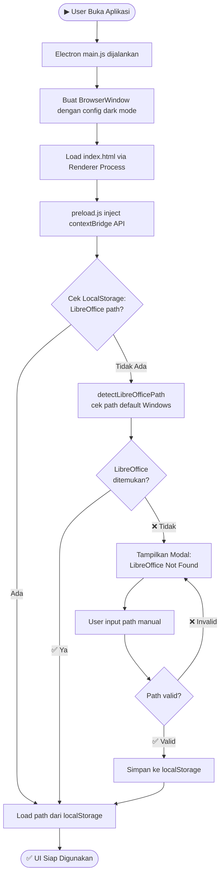
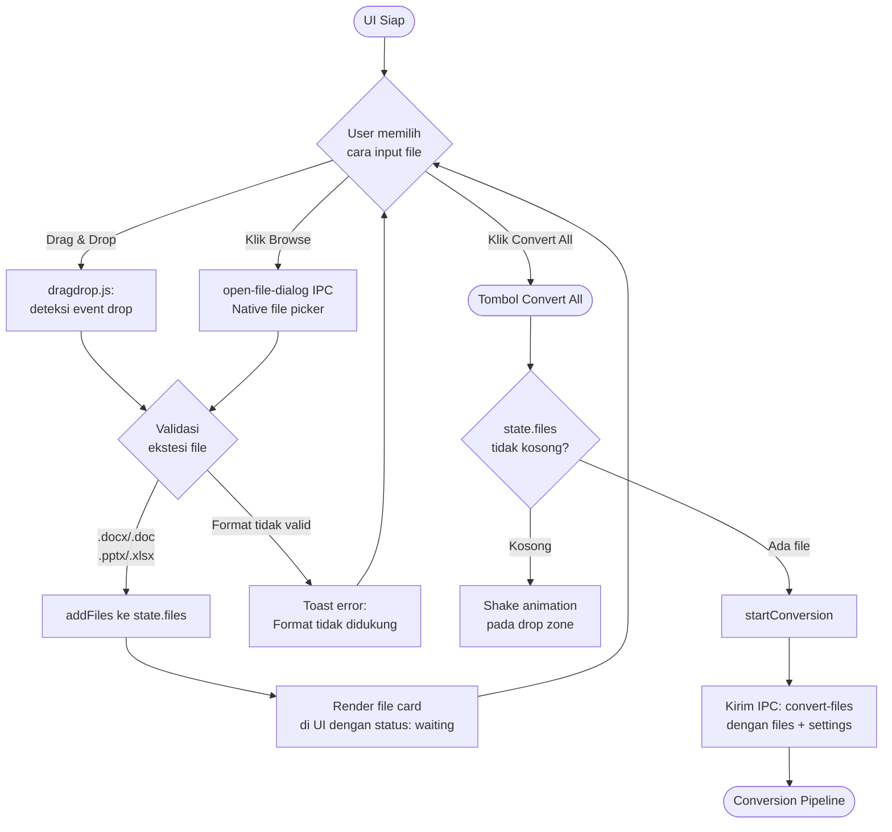
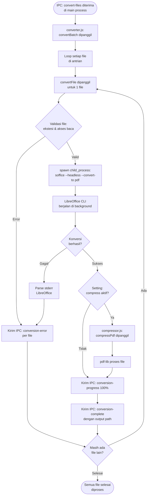
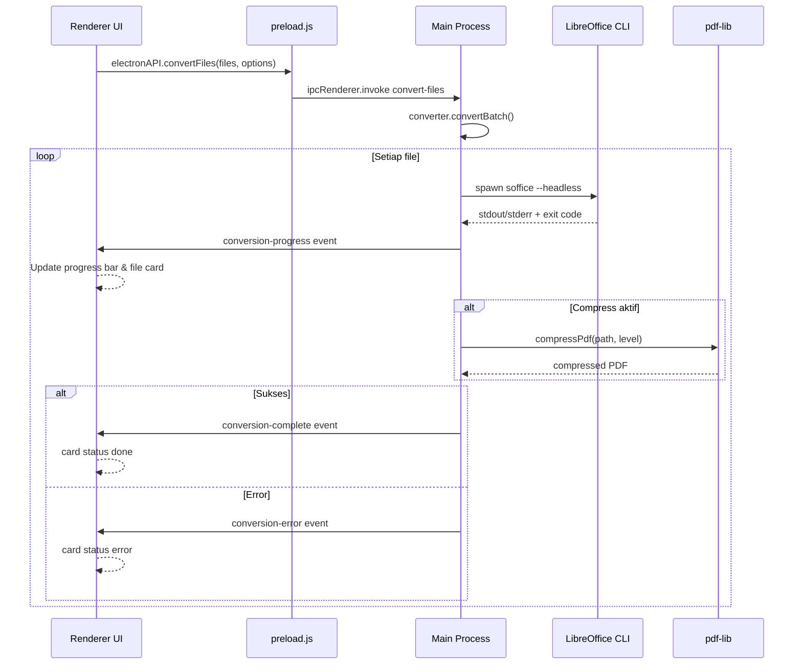
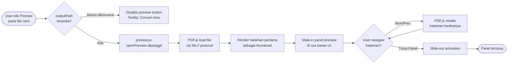
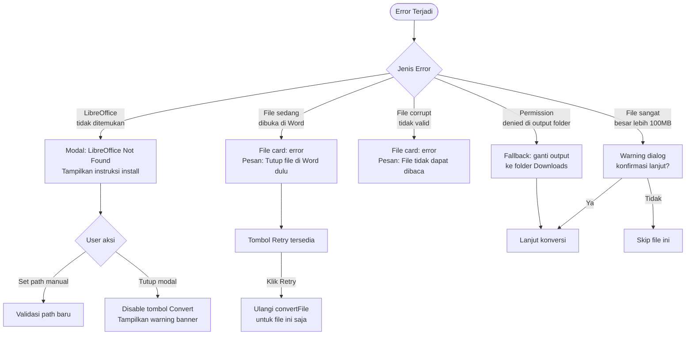
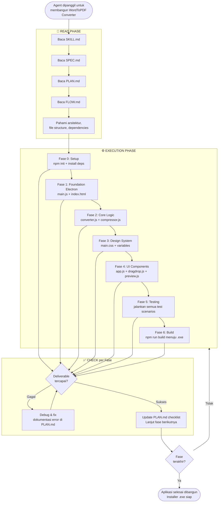
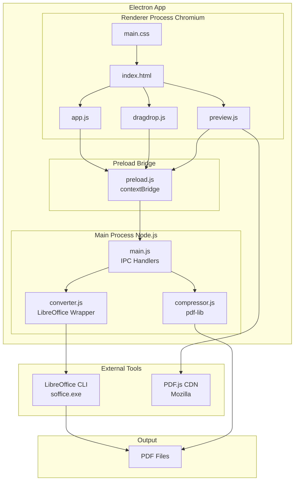

# 🔄 FLOW.md — Alur Proses Sistem WordToPDF Converter

> Dokumen ini menggambarkan seluruh alur proses sistem dari perspektif user, sistem internal, dan agent eksekutor.

---

## 1. 🚀 Alur Startup Aplikasi

---

## 2. 🖱️ Alur Interaksi User

---

## 3. ⚙️ Alur Konversi — Conversion Pipeline

---

## 4. 📡 Alur IPC Communication

---

## 5. 👁️ Alur PDF Preview

---

## 6. 🚨 Alur Error Handling

---

## 7. 🤖 Alur Agent Skill Execution

---

## 8. 🗂️ Ringkasan Komponen Sistem

