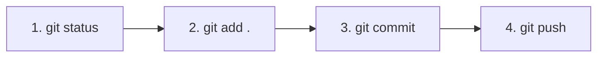

# 🚀 GITHUB.md — Panduan Git & GitHub Push

> Panduan lengkap alur kerja Git & GitHub untuk pengembang dan AI Agent pada proyek **WordToPDF Converter**.
> Meliputi pengaturan awal, standar commit, alur push, manajemen branch, hingga penanganan kendala umum.

---

## 📋 Daftar Isi

1. [Prasyarat & Konfigurasi Awal](#1-prasyarat--konfigurasi-awal)
2. [Menghubungkan Repository Lokal ke GitHub](#2-menghubungkan-repository-lokal-ke-github)
3. [Standar Pesan Commit (Conventional Commits)](#3-standar-pesan-commit-conventional-commits)
4. [Alur Kerja Push Harian (Workflow)](#4-alur-kerja-push-harian-workflow)
5. [Manajemen Branch & Pull Request](#5-manajemen-branch--pull-request)
6. [Penanganan Masalah & Solusi Error](#6-penanganan-masalah--solusi-error)
7. [Catatan Khusus untuk AI Coding Agent](#7-catatan-khusus-untuk-ai-coding-agent)

---

## 1. Prasyarat & Konfigurasi Awal

Sebelum melakukan push ke GitHub, pastikan Git telah terinstall dan terkoneksi dengan akun GitHub Anda.

### 1.1 Verifikasi Git
Buka PowerShell / Terminal lalu jalankan:
```bash
git --version
```

### 1.2 Identitas Pengembang (Global Config)
Set nama dan email akun GitHub Anda:
```bash
git config --global user.name "Nama Pengguna GitHub"
git config --global user.email "email@domain.com"
```

### 1.3 Autentikasi GitHub
Anda memiliki dua opsi autentikasi utama:

#### Opsi A: HTTPS dengan GitHub Personal Access Token (PAT)
1. Buka **GitHub Settings** → **Developer Settings** → **Personal Access Tokens** (Tokens classic).
2. Generate Token baru dengan izin (`repo`).
3. Saat melakukan `git push`, gunakan PAT sebagai kata sandi (password).

#### Opsi B: SSH Key (Rekomendasi)
1. Buat SSH key baru:
   ```bash
   ssh-keygen -t ed25519 -C "email@domain.com"
   ```
2. Salin isi public key (`cat ~/.ssh/id_ed25519.pub`).
3. Tambahkan ke akun GitHub Anda: **Settings** → **SSH and GPG keys** → **New SSH Key**.
4. Uji koneksi:
   ```bash
   ssh -T git@github.com
   ```

---

## 2. Menghubungkan Repository Lokal ke GitHub

Jika proyek baru diinisialisasi secara lokal dan belum terhubung ke GitHub:

### 2.1 Inisialisasi Git Lokal
```bash
cd c:\Users\Nopal\OneDrive\Documents\pdfConverter
git init
git branch -M main
```

### 2.2 Hubungkan ke Remote Repository
```bash
# Menggunakan HTTPS:
git remote add origin https://github.com/Naufal1-ai/pdfCreator.git

# ATAU Menggunakan SSH (Rekomendasi):
git remote add origin git@github.com:Naufal1-ai/pdfCreator.git
```

### 2.3 Verifikasi Remote
```bash
git remote -v
```

---

## 3. Standar Pesan Commit (Conventional Commits)

Proyek ini mewajibkan format pesan commit berbasis **Conventional Commits** agar riwayat perubahan rapi dan mudah dilacak.

### Format Utama:
```text
<type>(<scope>): <deskripsi singkat dalam bahasa indonesia/inggris>

[opsional: penjelasan rinci]
```

### Tipe Commit (`type`):
| Tipe | Penggunaan | Contoh |
|---|---|---|
| `feat` | Penambahan fitur baru | `feat(converter): tambah dukungan konversi pptx` |
| `fix` | Perbaikan bug / error | `fix(ui): perbaiki tata letak modal setting` |
| `docs` | Perubahan dokumen saja | `docs: tambah GITHUB.md dan update SKILL.md` |
| `style` | Formatting, titik koma, CSS visual tanpa ubah logic | `style(css): perbaiki warna gradient button` |
| `refactor` | Refaktor kode tanpa menambah fitur / fix bug | `refactor(main): optimasi fungsi IPC handler` |
| `test` | Menambah atau memperbaiki unit test | `test(converter): tambah test case file besar` |
| `chore` | Update build script, dependencies, config | `chore(deps): bump electron dari v28 ke v29` |

---

## 4. Alur Kerja Push Harian (Workflow)

Ikuti 4 langkah standar berikut saat hendak menyimpan perubahan ke GitHub:



### Langkah 1: Cek Perubahan Lengkap
Lihat file apa saja yang diubah, ditambah, atau dihapus:
```bash
git status
```

### Langkah 2: Stage File (Persiapan Commit)
```bash
# Untuk menambahkan semua perubahan:
git add .

# Atau tambahkan file spesifik (rekomendasi):
git add docs/GITHUB.md docs/SKILL.md
```

### Langkah 3: Buat Pesan Commit
```bash
git commit -m "docs: tambah GITHUB.md panduan push github"
```

### Langkah 4: Push ke Remot Repository
```bash
# Push ke branch main saat ini:
git push

# Jika pertama kali push branch baru:
git push -u origin main
```

---

## 5. Manajemen Branch & Pull Request

Untuk fitur besar atau eksperimen, gunakan fitur branch agar branch `main` tetap stabil.

### 5.1 Membuat & Pindah Branch Baru
```bash
git checkout -b feature/ui-redesign
```

### 5.2 Push Branch Baru ke Remote
```bash
git push -u origin feature/ui-redesign
```

### 5.3 Menggabungkan (Merge) ke Main
1. Buka repository di GitHub: `https://github.com/Naufal1-ai/pdfCreator`
2. Klik tombol **Compare & pull request**.
3. Berikan judul dan deskripsi ringkas mengenai perubahan.
4. Klik **Create pull request** dan lakukan **Merge**.
5. Di terminal lokal, kembalikan ke `main` dan tarik perubahan terbaru:
   ```bash
   git checkout main
   git pull origin main
   ```

---

## 6. Penanganan Masalah & Solusi Error

Berikut adalah daftar error Git yang sering ditemui beserta solusi praktisnya:

### ⚠️ 6.1 Error: `rejected (non-fast-forward)` / `fetch first`
**Penyebab:** Ada commit baru di GitHub yang belum ada di komputer lokal Anda.
**Solusi:**
```bash
git pull --rebase origin main
git push origin main
```

---

### ⚠️ 6.2 Error: `Authentication failed`
**Penyebab:** Password HTTPS tidak berlaku (GitHub sudah menghapus password login via HTTPS).
**Solusi:**
1. Gunakan SSH Key (ubah URL remote ke SSH):
   ```bash
   git remote set-url origin git@github.com:Naufal1-ai/pdfCreator.git
   ```
2. Atau perbarui Personal Access Token (PAT) di credential manager OS.

---

### ⚠️ 6.3 Error: Merge Conflict
**Penyebab:** Baris kode yang sama diubah di dua tempat berbeda.
**Solusi:**
1. Jalankan `git status` untuk melihat file mana yang bermasalah.
2. Buka file tersebut di VS Code/editor, pilih perubahan mana yang akan dipertahankan (`Accept Current` / `Accept Incoming`).
3. Simpan file, lalu jalankan:
   ```bash
   git add .
   git commit -m "fix: selesaikan conflict pada main process"
   git push
   ```

---

### ⚠️ 6.4 Membatalkan Commit Terakhir (Belum di-Push)
```bash
# Membatalkan commit tapi mempertahankan file yang diubah:
git reset --soft HEAD~1

# Membatalkan commit dan MEMBUANG semua perubahan file:
git reset --hard HEAD~1
```

---

### ⚠️ 6.5 Menghindari File Besar / File Sensitif (.gitignore)
Pastikan folder `node_modules`, `dist`, `.env`, dan temporary files terdaftar di `.gitignore` sebelum `git add`:

```text
# Node Modules
node_modules/

# Output Build
dist/
build/

# Temporary / Log
*.log
.DS_Store
Thumbs.db
```

---

## 7. Catatan Khusus untuk AI Coding Agent

Bagi AI Coding Agent yang memelihara repository ini, ikuti **Protokol Push Otomatis** berikut:

### 7.1 Protokol Push Otomatis Agent (Automated Push Policy)

1. **Trigger Otomatis:**
   - Agent **WAJIB** melakukan `git commit` dan `git push` otomatis setiap kali **SATU FASE LENGKAP** pada [`docs/PLAN.md`](PLAN.md) selesai dikerjakan dan diverifikasi.
   - Jangan melakukan push untuk setiap baris kode kecil, tetapi lakukan per babak (per Fase).

2. **Format Pesan Commit Otomatis:**
   - Gunakan format **Conventional Commits** berbasis Fase:
     ```text
     feat(phase0): setup environment & inisialisasi electron dependencies
     feat(phase1): fondasi electron window & preload context bridge
     feat(phase2): implementasi core logic konversi libreoffice & compressor
     style(phase3): implementasi design system ui & komponen dark mode
     feat(phase4): integrasi ui drag-drop, preview & state management
     test(phase5): integrasi testing 12 skenario konversi & bugfix
     chore(phase6): polish ui, app icon & build installer exe
     ```

3. **Protokol Auto-Recovery Kegagalan Push:**
   - Jika perintah `git push` gagal (misal: remote rejected atau network timeout):
     1. Agent secara otomatis menjalankan `git pull --rebase origin main`.
     2. Agent mencoba `git push` kembali (maksimal 2 kali percobaan otomatis).
     3. Jika masih gagal setelah 2 kali percobaan, hentikan proses dan laporkan error secara transparan ke user.

4. **Keamanan Staging Area:**
   - JANGAN gunakan wildcard `git add .` jika ada file scratch atau temporary logs yang tidak relevan.
   - Selalu jalankan `git status` terlebih dahulu sebelum dan sesudah commit untuk memastikan staging area bersih.
   - Gunakan `WaitMsBeforeAsync: 8000` pada tool `run_command` saat `git push`.

---

*Dokumen ini dibuat untuk memastikan konsistensi alur kerja pengkodean dan kolaborasi antara pengembang dan AI Agent pada proyek WordToPDF Converter.*
